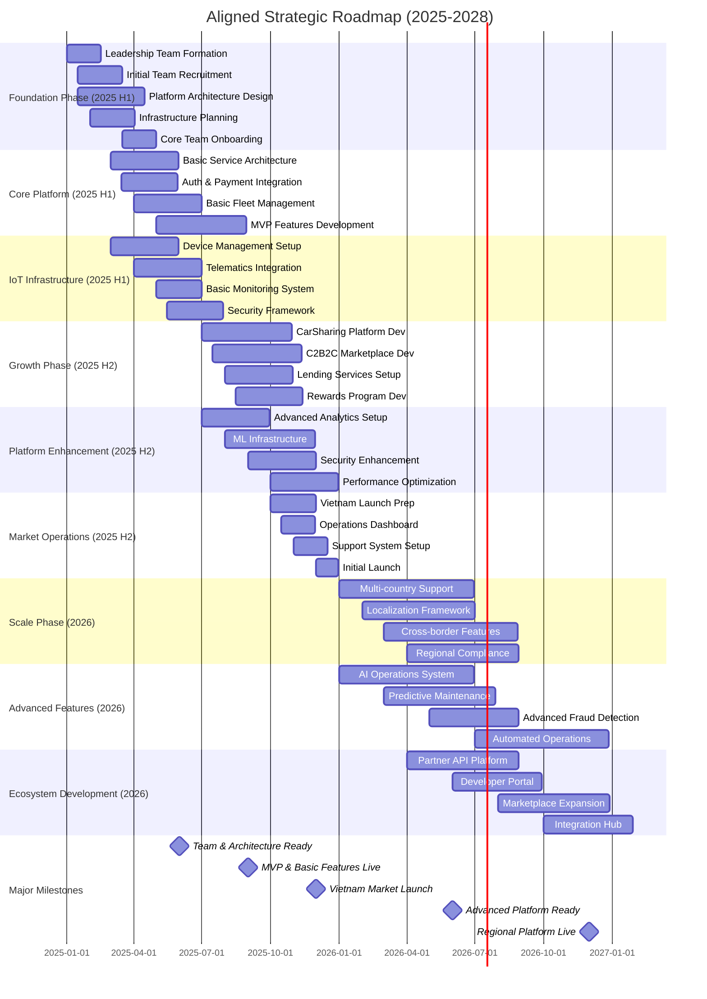

```mermaid
gantt
    title Aligned Strategic Roadmap (2025-2028)
    dateFormat  YYYY-MM-DD

    section Foundation Phase (2025 H1)
    Leadership Team Formation      :a1, 2025-01-01, 45d
    Initial Team Recruitment      :a2, 2025-01-15, 60d
    Platform Architecture Design  :a3, 2025-01-15, 90d
    Infrastructure Planning       :a4, 2025-02-01, 60d
    Core Team Onboarding         :a5, after a2, 45d

    section Core Platform (2025 H1)
    Basic Service Architecture    :b1, 2025-03-01, 90d
    Auth & Payment Integration    :b2, 2025-03-15, 75d
    Basic Fleet Management       :b3, 2025-04-01, 90d
    MVP Features Development     :b4, 2025-05-01, 120d

    section IoT Infrastructure (2025 H1)
    Device Management Setup      :c1, 2025-03-01, 90d
    Telematics Integration      :c2, 2025-04-01, 90d
    Basic Monitoring System     :c3, 2025-05-01, 60d
    Security Framework          :c4, 2025-05-15, 75d

    section Growth Phase (2025 H2)
    CarSharing Platform Dev     :d1, 2025-07-01, 120d
    C2B2C Marketplace Dev       :d2, 2025-07-15, 120d
    Lending Services Setup      :d3, 2025-08-01, 90d
    Rewards Program Dev         :d4, 2025-08-15, 90d

    section Platform Enhancement (2025 H2)
    Advanced Analytics Setup    :e1, 2025-07-01, 90d
    ML Infrastructure          :e2, 2025-08-01, 120d
    Security Enhancement       :e3, 2025-09-01, 90d
    Performance Optimization   :e4, 2025-10-01, 90d

    section Market Operations (2025 H2)
    Vietnam Launch Prep        :f1, 2025-10-01, 60d
    Operations Dashboard       :f2, 2025-10-15, 45d
    Support System Setup       :f3, 2025-11-01, 45d
    Initial Launch            :f4, 2025-12-01, 30d

    section Scale Phase (2026)
    Multi-country Support     :g1, 2026-01-01, 180d
    Localization Framework    :g2, 2026-02-01, 150d
    Cross-border Features     :g3, 2026-03-01, 180d
    Regional Compliance       :g4, 2026-04-01, 150d

    section Advanced Features (2026)
    AI Operations System      :h1, 2026-01-01, 180d
    Predictive Maintenance    :h2, 2026-03-01, 150d
    Advanced Fraud Detection  :h3, 2026-05-01, 120d
    Automated Operations      :h4, 2026-07-01, 180d

    section Ecosystem Development (2026)
    Partner API Platform      :i1, 2026-04-01, 150d
    Developer Portal          :i2, 2026-06-01, 120d
    Marketplace Expansion     :i3, 2026-08-01, 150d
    Integration Hub           :i4, 2026-10-01, 120d

    section Major Milestones
    Team & Architecture Ready    :milestone, m1, 2025-06-01, 0d
    MVP & Basic Features Live    :milestone, m2, 2025-09-01, 0d
    Vietnam Market Launch        :milestone, m3, 2025-12-01, 0d
    Advanced Platform Ready      :milestone, m4, 2026-06-01, 0d
    Regional Platform Live       :milestone, m5, 2026-12-01, 0d
```
