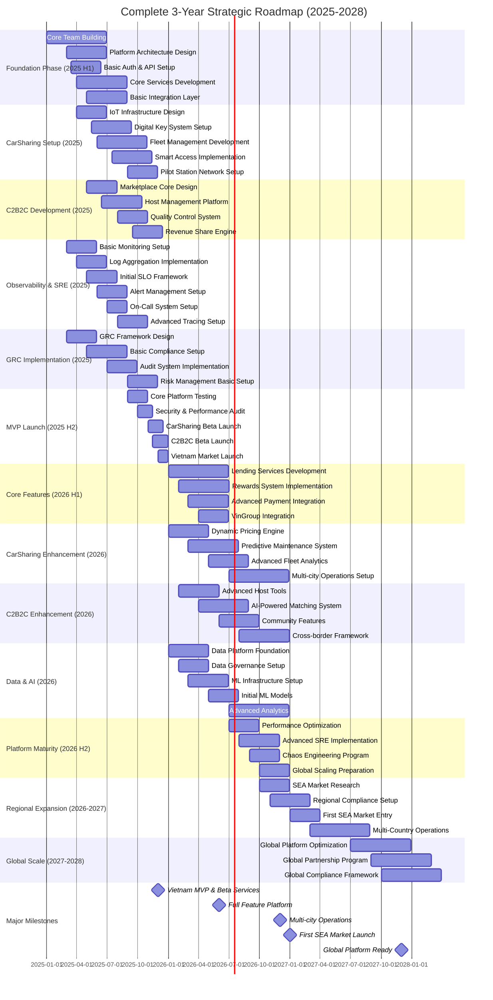

```mermaid
gantt
    title Complete 3-Year Strategic Roadmap (2025-2028)
    dateFormat  YYYY-MM-DD

    section Foundation Phase (2025 H1)
    Core Team Building              :a1, 2025-01-01, 180d
    Platform Architecture Design    :a2, 2025-03-01, 120d
    Basic Auth & API Setup         :a3, 2025-03-15, 90d
    Core Services Development      :a4, 2025-04-01, 150d
    Basic Integration Layer        :a5, 2025-05-01, 120d

    section CarSharing Setup (2025)
    IoT Infrastructure Design      :cs1, 2025-04-01, 90d
    Digital Key System Setup       :cs2, 2025-05-15, 120d
    Fleet Management Development   :cs3, 2025-06-01, 150d
    Smart Access Implementation    :cs4, 2025-07-15, 120d
    Pilot Station Network Setup    :cs5, 2025-09-01, 90d

    section C2B2C Development (2025)
    Marketplace Core Design        :c2c1, 2025-05-01, 90d
    Host Management Platform       :c2c2, 2025-06-15, 120d
    Quality Control System         :c2c3, 2025-08-01, 90d
    Revenue Share Engine           :c2c4, 2025-09-15, 90d

    section Observability & SRE (2025)
    Basic Monitoring Setup         :b1, 2025-03-01, 90d
    Log Aggregation Implementation :b2, 2025-04-01, 90d
    Initial SLO Framework         :b3, 2025-05-01, 90d
    Alert Management Setup        :b4, 2025-06-01, 90d
    On-Call System Setup          :b5, 2025-07-01, 60d
    Advanced Tracing Setup        :b6, 2025-08-01, 90d

    section GRC Implementation (2025)
    GRC Framework Design          :c1, 2025-03-01, 90d
    Basic Compliance Setup        :c2, 2025-05-01, 120d
    Audit System Implementation   :c3, 2025-07-01, 90d
    Risk Management Basic Setup   :c4, 2025-09-01, 90d

    section MVP Launch (2025 H2)
    Core Platform Testing         :d1, 2025-09-01, 60d
    Security & Performance Audit  :d2, 2025-10-01, 45d
    CarSharing Beta Launch       :d3, 2025-11-01, 45d
    C2B2C Beta Launch           :d4, 2025-11-15, 45d
    Vietnam Market Launch        :d5, 2025-12-01, 30d

    section Core Features (2026 H1)
    Lending Services Development  :e1, 2026-01-01, 180d
    Rewards System Implementation :e2, 2026-02-01, 150d
    Advanced Payment Integration  :e3, 2026-03-01, 120d
    VinGroup Integration         :e4, 2026-04-01, 90d

    section CarSharing Enhancement (2026)
    Dynamic Pricing Engine        :cs6, 2026-01-01, 120d
    Predictive Maintenance System :cs7, 2026-03-01, 150d
    Advanced Fleet Analytics      :cs8, 2026-05-01, 120d
    Multi-city Operations Setup   :cs9, 2026-07-01, 180d

    section C2B2C Enhancement (2026)
    Advanced Host Tools           :c2c5, 2026-02-01, 120d
    AI-Powered Matching System    :c2c6, 2026-04-01, 150d
    Community Features            :c2c7, 2026-06-01, 120d
    Cross-border Framework        :c2c8, 2026-08-01, 150d

    section Data & AI (2026)
    Data Platform Foundation     :f1, 2026-01-01, 120d
    Data Governance Setup        :f2, 2026-02-01, 90d
    ML Infrastructure Setup      :f3, 2026-03-01, 120d
    Initial ML Models           :f4, 2026-05-01, 90d
    Advanced Analytics          :f5, 2026-07-01, 180d

    section Platform Maturity (2026 H2)
    Performance Optimization    :g1, 2026-07-01, 90d
    Advanced SRE Implementation :g2, 2026-08-01, 120d
    Chaos Engineering Program   :g3, 2026-09-01, 90d
    Global Scaling Preparation  :g4, 2026-10-01, 90d

    section Regional Expansion (2026-2027)
    SEA Market Research         :h1, 2026-10-01, 90d
    Regional Compliance Setup   :h2, 2026-11-01, 120d
    First SEA Market Entry      :h3, 2027-01-01, 90d
    Multi-Country Operations    :h4, 2027-03-01, 180d

    section Global Scale (2027-2028)
    Global Platform Optimization :i1, 2027-07-01, 180d
    Global Partnership Program   :i2, 2027-09-01, 180d
    Global Compliance Framework  :i3, 2027-10-01, 180d

    section Major Milestones
    Vietnam MVP & Beta Services   :milestone, m1, 2025-12-01, 0d
    Full Feature Platform         :milestone, m2, 2026-06-01, 0d
    Multi-city Operations         :milestone, m3, 2026-12-01, 0d
    First SEA Market Launch       :milestone, m4, 2027-01-01, 0d
    Global Platform Ready         :milestone, m5, 2027-12-01, 0d
```
