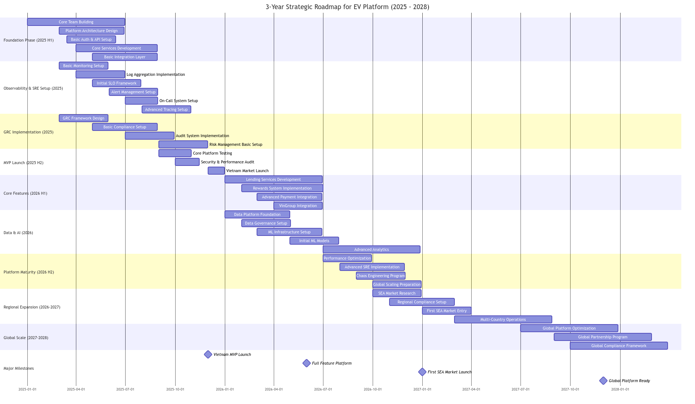

# CTO Strategic Proposal

- [CTO Strategic Proposal](#cto-strategic-proposal)
  - [EV Platform Development and Digital Transformation (2025-2028)](#ev-platform-development-and-digital-transformation-2025-2028)
    - [Executive Summary](#executive-summary)
    - [Strategic Objectives](#strategic-objectives)
    - [Key Success Metrics](#key-success-metrics)
    - [Implementation Strategy](#implementation-strategy)
      - [1. Organization Structure](#1-organization-structure)
      - [2. Resource Planning](#2-resource-planning)
      - [3. Technology Stack Selection](#3-technology-stack-selection)
    - [Budget Allocation (3-Year Estimate)](#budget-allocation-3-year-estimate)
    - [Risk Management](#risk-management)
    - [Implementation Roadmap](#implementation-roadmap)
      - [Phase 1: Foundation (2025)](#phase-1-foundation-2025)
      - [Phase 2: Growth (2026)](#phase-2-growth-2026)
      - [Phase 3: Scale (2027-2028)](#phase-3-scale-2027-2028)
    - [Critical Success Factors](#critical-success-factors)
    - [Next Steps](#next-steps)
  - [High-level Architecture](#high-level-architecture)
  - [Gantt Chart](#gantt-chart)
  - [References](#references)

## EV Platform Development and Digital Transformation (2025-2028)

### Executive Summary

This proposal outlines a comprehensive three-year strategy to build and scale a state-of-the-art EV platform serving both B2B and B2C markets. The platform will initially serve Vietnam before expanding across SEA and globally, integrating with VinGroup's ecosystem while maintaining world-class standards in technology, security, and compliance.

### Strategic Objectives

1. Build a scalable, secure, and compliant EV platform
2. Establish market leadership in Vietnam
3. Enable regional expansion across SEA
4. Create a comprehensive mobility ecosystem
5. Achieve operational excellence through technology

### Key Success Metrics

1. Technical KPIs

   - Platform Reliability: 99.99% uptime
   - API Response Time: <100ms (p95)
   - Transaction Success Rate: >99.9%
   - Security Incidents: Zero critical breaches
   - Release Frequency: Weekly deployments

2. Business KPIs
   - User Acquisition Cost reduction: 25%
   - Customer Satisfaction Score: >4.5/5
   - Platform Adoption Rate: 40% YoY growth
   - Transaction Volume: 50% YoY growth
   - Partner Integration Time: <4 weeks

### Implementation Strategy

#### 1. Organization Structure

```
CTO Office
├── Platform Engineering
│   ├── Core Services Team
│   ├── Frontend Team (Mobile & Web)
│   └── API & Integration Team
├── Infrastructure & Security
│   ├── DevOps & SRE Team
│   ├── Security Team
│   └── Platform Operations Team
├── Data & AI
│   ├── Data Engineering Team
│   ├── Data Science Team
│   └── ML Operations Team
└── Quality & Compliance
    ├── QA & Automation Team
    ├── GRC Team
    └── Technical Documentation Team
```

#### 2. Resource Planning

Phase 1 (2025 H1): Foundation Team

- 1 Chief Architect
- 2 Technical Product Managers
- 8 Senior Backend Engineers
- 6 Frontend Engineers (3 Mobile, 3 Web)
- 4 DevOps/SRE Engineers
- 2 Security Engineers
- 4 QA Engineers
  Total: 27 technical staff

Phase 2 (2025 H2): Scale Team

- 4 Additional Backend Engineers
- 4 Additional Frontend Engineers
- 2 Data Engineers
- 2 ML Engineers
- 2 Additional DevOps Engineers
- 2 Additional QA Engineers
  Total: 43 technical staff

Phase 3 (2026): Full Scale

- Platform Teams: 60+ engineers
- Data & AI Teams: 20+ specialists
- Operations & Support: 20+ staff
  Total: 100+ technical staff

#### 3. Technology Stack Selection

Core Platform:

- Backend: Java (Spring Boot), Go
- Frontend: React Native, React.js
- API: GraphQL, REST
- Database: PostgreSQL, MongoDB
- Cache: Redis
- Message Queue: Kafka

Infrastructure:

- Cloud: Multi-cloud strategy (AWS primary)
- Containers: Kubernetes
- CI/CD: GitLab, ArgoCD
- Monitoring: Prometheus, Grafana, ELK Stack
- APM: New Relic/Datadog

Security:

- IAM: Keycloak
- WAF: Cloudflare
- SIEM: Splunk
- Secrets: HashiCorp Vault

Data Platform:

- Processing: Apache Spark
- Warehouse: Snowflake
- ML Ops: Kubeflow
- Analytics: Looker/Tableau

### Budget Allocation (3-Year Estimate)

1. Personnel Costs (45%):

   - Engineering Teams: $15M
   - Leadership & Management: $3M
   - Training & Development: $1M

2. Infrastructure & Tools (25%):

   - Cloud Infrastructure: $5M
   - Software Licenses: $3M
   - Development Tools: $2M

3. Security & Compliance (15%):

   - Security Tools & Audits: $2.5M
   - Compliance Certifications: $2M
   - Security Operations: $1.5M

4. R&D and Innovation (15%):
   - Research Projects: $3M
   - Innovation Lab: $2M
   - POCs & Experiments: $1M

Total 3-Year Budget: $41M

### Risk Management

1. Technical Risks:

   - Scalability challenges
   - Integration complexity
   - Technical debt
   - Security vulnerabilities

   Mitigation: Architecture reviews, security audits, regular technical debt sprints

2. Team Risks:

   - Talent acquisition
   - Knowledge retention
   - Team scaling

   Mitigation: Competitive packages, training programs, documentation culture

3. Operational Risks:

   - Service disruptions
   - Data breaches
   - Compliance issues

   Mitigation: SRE practices, security-first approach, compliance automation

4. Market Risks:
   - Changing regulations
   - Market competition
   - Technology changes

Mitigation: Agile development, modular architecture, regular market analysis

### Implementation Roadmap

#### Phase 1: Foundation (2025)

- Core team formation
- Basic platform development
- Vietnam market launch
- Essential integrations

#### Phase 2: Growth (2026)

- Feature expansion
- Data platform development
- AI/ML implementation
- Regional preparation

#### Phase 3: Scale (2027-2028)

- Global platform optimization
- Advanced AI capabilities
- Multi-country operations
- Innovation programs

### Critical Success Factors

1. Leadership Support:

   - Clear vision and mandate
   - Resource commitment
   - Strategic alignment

2. Technical Excellence:

   - Architecture governance
   - Engineering standards
   - Innovation culture

3. Operational Excellence:

   - SRE practices
   - Security measures
   - Quality processes

4. Team Excellence:
   - Talent acquisition
   - Continuous learning
   - Performance culture

### Next Steps

1. Immediate Actions (Next 30 Days):

   - Leadership team formation
   - Detailed project planning
   - Initial team recruitment
   - Infrastructure setup

2. Short Term (90 Days):

   - Core team onboarding
   - Architecture finalization
   - Development kickoff
   - Process establishment

3. Medium Term (180 Days):
   - MVP development
   - Initial testing
   - Security implementation
   - Team expansion

## High-level Architecture


## Gantt Chart



- [Mermaid Chart](./GSM-Gantt.md)

## References

- [Comprehensive_Strategy_for_the_CTO_Role.pdf](./Comprehensive_Strategy_for_the_CTO_Role.pdf)
- [Architecting Trust](https://medium.com/@dao.t.anh/architecting-trust-b768072c3f76)
- [The Role of a CTO in a FinTech Start-up: A Journey Through My Lens as a Distinguished Software Architect — Chapter 1: Introduction](https://medium.com/@dao.t.anh/the-role-of-a-cto-in-a-fintech-start-up-a-journey-through-my-lens-as-a-distinguished-software-372d40e541d1)
