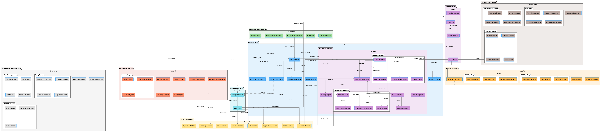
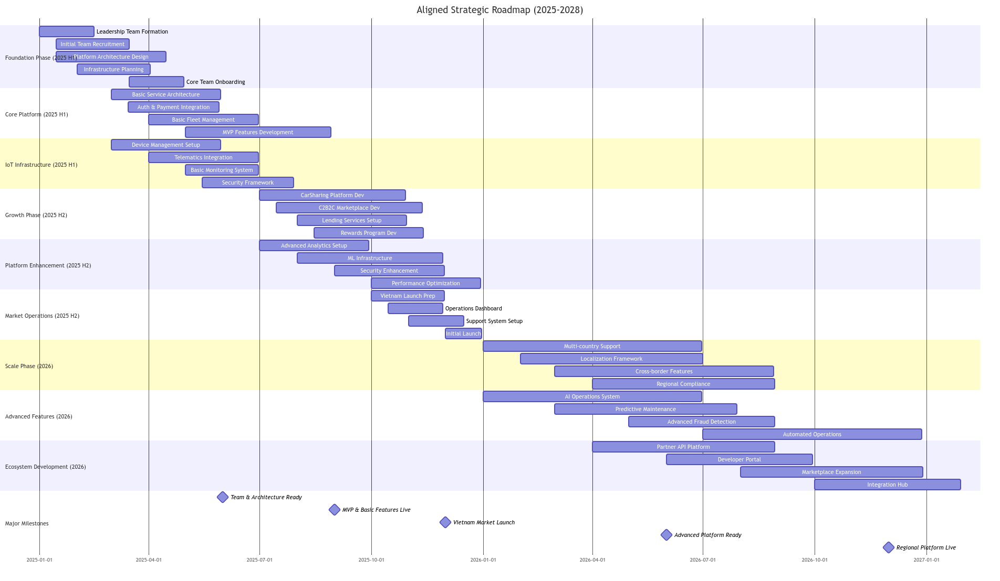

# CTO Strategic Proposal

## Comprehensive EV Mobility Ecosystem (2025-2028)

### Executive Summary

This proposal presents a comprehensive three-year strategy to build and scale a next-generation mobility ecosystem for the Vietnamese and Southeast Asian markets. Our vision encompasses:

1. Core Capabilities:

   - EV Platform (B2B/B2C)
   - CarSharing Services
   - C2B2C Marketplace
   - Financial Services (Lending/BNPL)
   - Rewards & Loyalty Program

2. Market Approach:

   - Initial focus on Vietnam
   - Expansion to SEA markets
   - Deep integration with VinGroup ecosystem
   - Global platform standards

3. Key Differentiators:
   - Comprehensive mobility solutions
   - Integrated financial services
   - IoT-enabled smart features
   - Data-driven operations

### Strategic Objectives

1. Business Objectives:

   - Establish market leadership in Vietnam's EV ecosystem
   - Create SEA's largest EV sharing network
   - Enable peer-to-peer vehicle sharing economy
   - Drive financial inclusion through lending products
   - Build sustainable mobility ecosystem

2. Technical Objectives:
   - Build scalable, secure platform architecture
   - Implement IoT-enabled fleet management
   - Develop AI-driven operational efficiency
   - Ensure regulatory compliance across markets
   - Achieve technical excellence in operations

### Success Metrics

1. Platform Performance:

   - System Availability: 99.99%
   - API Response Time: <100ms (p95)
   - Transaction Success: >99.9%
   - Security: Zero critical incidents
   - Release Cadence: Weekly

2. Business Performance:

   - Vehicle Utilization: >40%
   - User Satisfaction: >4.5/5
   - Host Retention: >80%
   - Cross-service Usage: 30%
   - Revenue Growth: >50% YoY

3. Operational Excellence:
   - Fleet Availability: >95%
   - Support Response: <30 minutes
   - Issue Resolution: <24 hours
   - Quality Score: >4.3/5

### Implementation Strategy

#### 1. Organizational Structure

```
CTO Office
├── Platform Engineering
│   ├── Core Services Team
│   ├── Frontend Team (Mobile & Web)
│   ├── API & Integration Team
│   ├── CarSharing Platform Team
│   └── Marketplace Platform Team
├── IoT & Hardware
│   ├── IoT Development Team
│   ├── Hardware Integration Team
│   └── Smart Access Team
├── Infrastructure & Security
│   ├── DevOps & SRE Team
│   ├── Security Team
│   └── Platform Operations Team
├── Data & AI
│   ├── Data Engineering Team
│   ├── Data Science Team
│   ├── ML Operations Team
│   └── IoT Analytics Team
└── Quality & Compliance
    ├── QA & Automation Team
    ├── GRC Team
    └── Technical Documentation Team
```

#### 2. Phased Team Growth

Phase 1 (2025 H1): 28 Staff

- Leadership: 4
- Platform Engineering: 12
- IoT & Hardware: 4
- Infrastructure & Security: 4
- Quality & Compliance: 4

Phase 2 (2025 H2): 45 Staff

- Additional Leadership: 2
- Platform Engineering: +6
- IoT & Hardware: +3
- Data & AI: +4
- Quality & Support: +2

Phase 3 (2026): 85 Staff

- Additional Leadership: 3
- Platform Engineering: +12
- IoT & Hardware: +6
- Infrastructure & Security: +6
- Data & AI: +8
- Quality & Compliance: +5

#### 3. Technology Architecture

1. Core Platform:

   - Backend: Java (Spring Boot), Go
   - Frontend: React Native, React.js
   - API: GraphQL, REST
   - Database: PostgreSQL, MongoDB
   - Cache: Redis
   - Message Queue: Kafka

2. IoT Stack:

   - Platform: AWS IoT Core
   - Connectivity: MQTT, LTE-M
   - Edge Computing: AWS Greengrass
   - Device Security: HSM
   - Analytics: AWS IoT Analytics

3. Infrastructure:

   - Cloud: AWS (Primary)
   - Containers: Kubernetes
   - CI/CD: GitLab, ArgoCD
   - Monitoring: Prometheus, Grafana
   - APM: New Relic

4. Security:

   - IAM: Keycloak
   - WAF: Cloudflare
   - SIEM: Splunk
   - Secrets: HashiCorp Vault

5. Data Platform:
   - Processing: Apache Spark
   - Warehouse: Snowflake
   - ML Ops: Kubeflow
   - Analytics: Looker

### Implementation Roadmap

#### Phase 1: Foundation (2025 H1)

1. Core Platform Development:

   - Basic service architecture
   - Authentication & authorization
   - Payment integration
   - Basic fleet management
   - MVP features

2. IoT Infrastructure:

   - Device management
   - Telematics integration
   - Basic monitoring
   - Security framework

3. Quality & Security:
   - CI/CD pipeline
   - Security controls
   - Testing framework
   - Basic monitoring

#### Phase 2: Growth (2025 H2)

1. Advanced Features:

   - CarSharing platform
   - C2B2C marketplace
   - Lending services
   - Rewards program

2. Platform Enhancement:

   - Advanced analytics
   - ML capabilities
   - Advanced security
   - Performance optimization

3. Market Operations:
   - Vietnam launch
   - Operations dashboard
   - Customer support
   - Partner integration

#### Phase 3: Scale (2026)

1. Regional Expansion:

   - Multi-country support
   - Localization framework
   - Cross-border capabilities
   - Regional compliance

2. Advanced Capabilities:

   - AI-driven operations
   - Predictive maintenance
   - Advanced fraud detection
   - Automated operations

3. Ecosystem Development:
   - Partner API platform
   - Developer portal
   - Marketplace expansion
   - Integration hub

### Budget Summary (3-Year)

1. Personnel Costs (50%): $18M

   - Direct Salaries: $14M
   - Benefits & Insurance: $2M
   - Training & Development: $1M
   - Performance Bonuses: $1M

2. Infrastructure & Tools (20%): $7M

   - Cloud Infrastructure: $4M
   - Software Licenses: $2M
   - Development Tools: $1M

3. IoT & Hardware (15%): $5M

   - IoT Infrastructure: $2.5M
   - Hardware Devices: $1.5M
   - Network Connectivity: $1M

4. Security & Compliance (8%): $3M

   - Security Tools & Audits: $1.5M
   - Compliance Certifications: $1M
   - Security Operations: $0.5M

5. R&D and Innovation (7%): $2M
   - Research Projects: $1M
   - Innovation Lab: $0.5M
   - POCs & Experiments: $0.5M

Total 3-Year Budget: $35M

### Risk Management

1. Technical Risks:
   - Scalability challenges
   - Integration complexity
   - Technical debt
   - Security vulnerabilities

Mitigation: Architecture reviews, security audits, technical debt sprints

2. Operational Risks:
   - Service disruptions
   - Data breaches
   - Compliance issues
   - Quality control

Mitigation: SRE practices, security-first approach, compliance automation

3. Market Risks:
   - Adoption rates
   - Competition
   - Regulatory changes
   - Market conditions

Mitigation: Agile development, modular architecture, regular market analysis

### Success Factors

1. Leadership Support:

   - Clear vision and mandate
   - Resource commitment
   - Strategic alignment

2. Technical Excellence:

   - Architecture governance
   - Engineering standards
   - Innovation culture

3. Operational Excellence:

   - SRE practices
   - Security measures
   - Quality processes

4. Team Excellence:
   - Talent acquisition
   - Continuous learning
   - Performance culture

### Next Steps

1. Immediate (30 Days):

   - Leadership team formation
   - Initial team recruitment
   - Infrastructure planning
   - Architecture design

2. Short-term (90 Days):

   - Core team onboarding
   - Development kickoff
   - MVP planning
   - Partner engagement

3. Medium-term (180 Days):
   - MVP development
   - Initial testing
   - Market preparation
   - Operations setup

## High-level Architecture



## Gantt Chart



- [Mermaid Chart](./FGF-Gantt.md)

## References

- [Comprehensive_Strategy_for_the_CTO_Role.pdf](./Comprehensive_Strategy_for_the_CTO_Role.pdf)
- [Architecting Trust](https://medium.com/@dao.t.anh/architecting-trust-b768072c3f76)
- [The Role of a CTO in a FinTech Start-up: A Journey Through My Lens as a Distinguished Software Architect — Chapter 1: Introduction](https://medium.com/@dao.t.anh/the-role-of-a-cto-in-a-fintech-start-up-a-journey-through-my-lens-as-a-distinguished-software-372d40e541d1)
